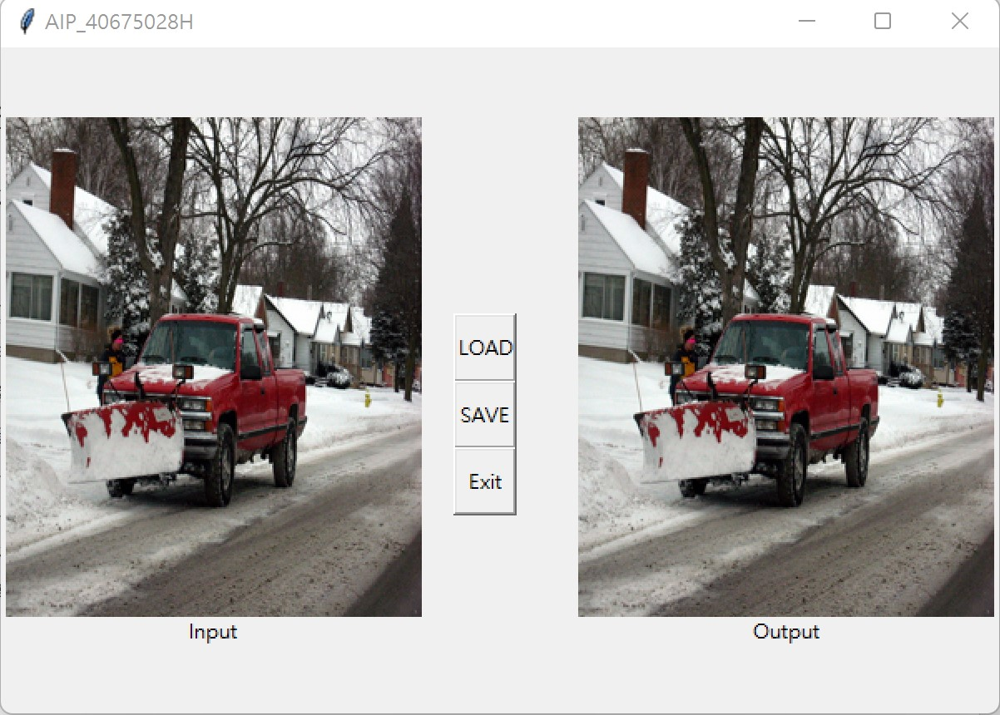
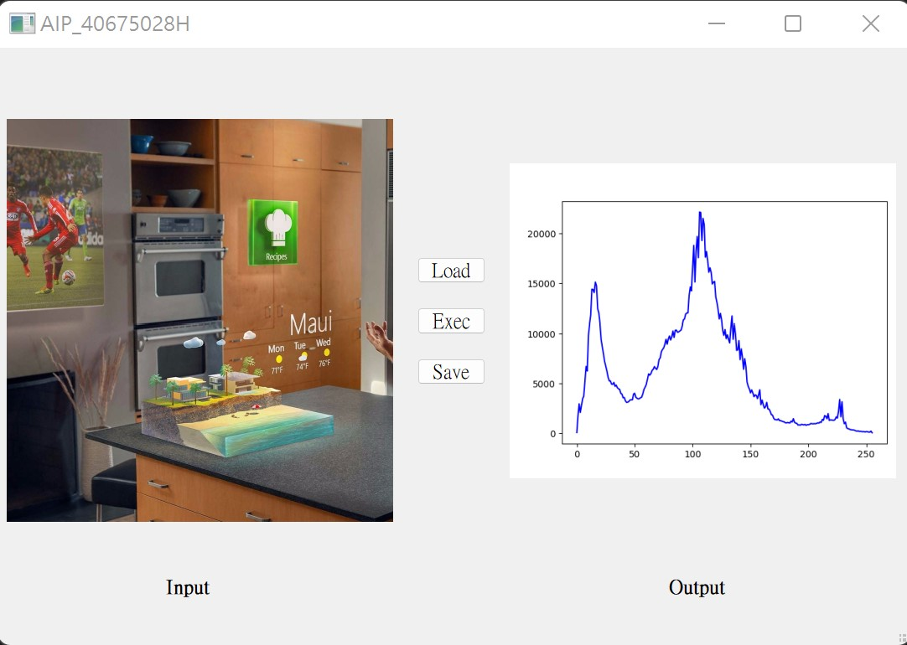
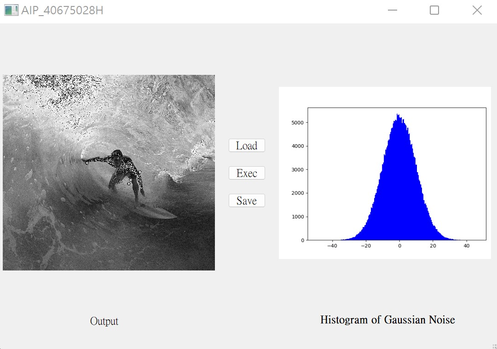
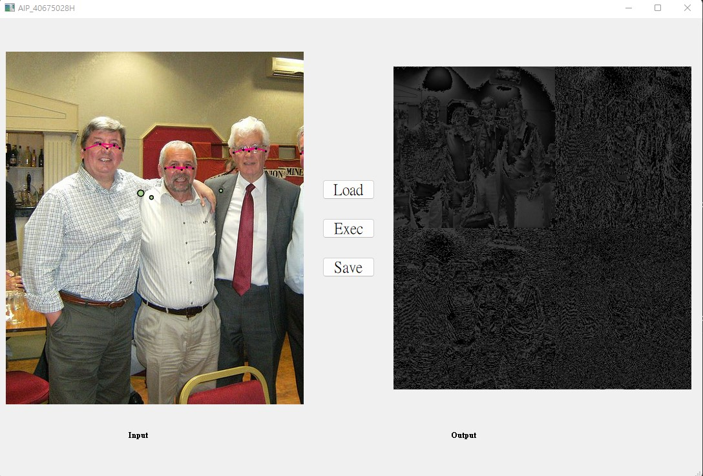
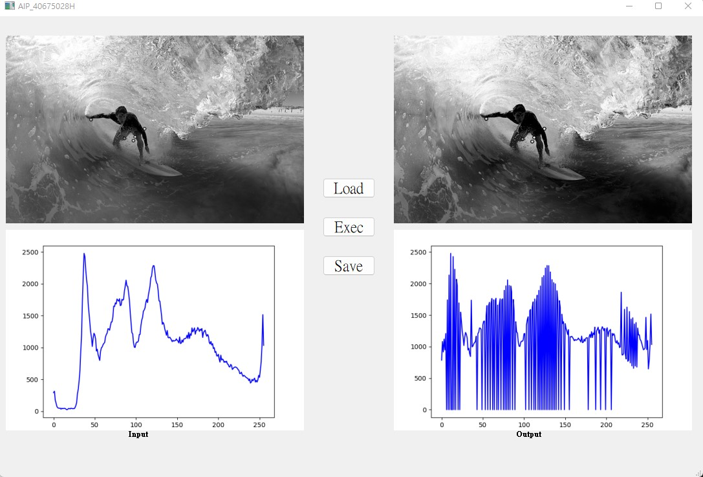
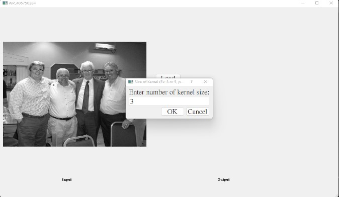
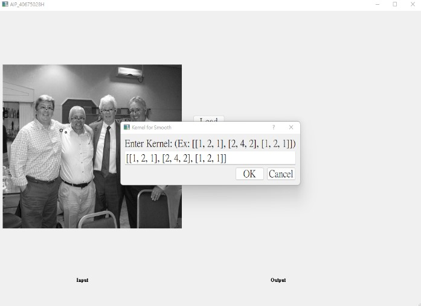
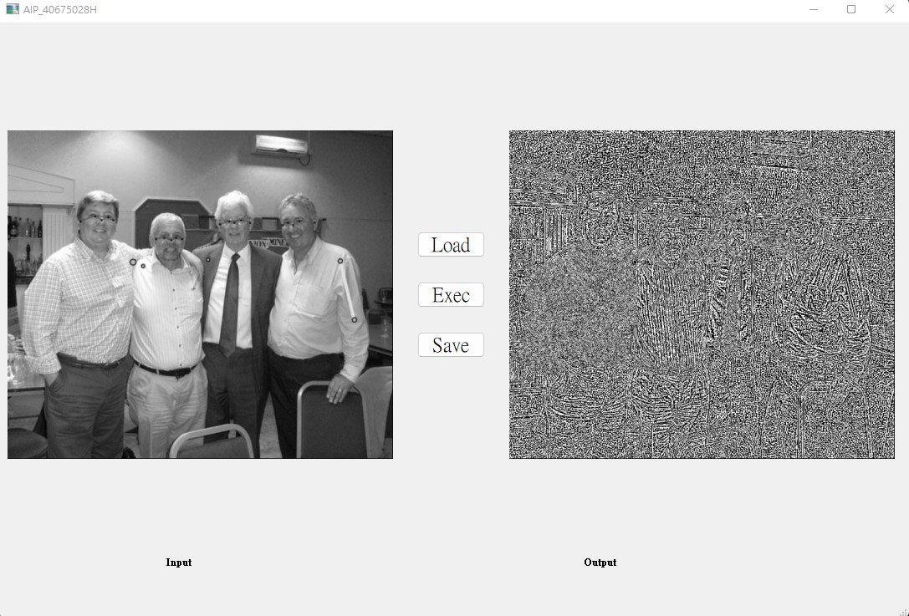

# Advanced Image Processing Fall 2021, NTNU.

- This code is for implementation of the assignments in **AIP** class in NTNU. There are 6 assignments and each assignment needs to create a execution file (for Windows).

## Assignment I 
- Read an image and output an image.
<tr>
<div align="center">
  
</div>
</tr>

## Assignemnt II
- Plot the gray scale histogram of the input image.

<tr>
<div align="center">
  
</div>
</tr>

## Assignment III
- Add gaussain noise to the input image.
- Plot the histogram of the gaussain noised image.
<tr>
<div align="center">
  
</div>
</tr>

## Assignment IV
- Write the **Haar Wavelet Transform** algorithm, and apply the algorithm to the input image.
<tr>
<div align="center">
  
</div>
</tr>

## Assignment V
- Write the **Histogram Equalization** algorithm, and apply it.
- Plot the gray scale histogram to both input and output images. 
<tr>
<div align="center">
  
</div>
</tr>

## Assignment VI 
- Design convolution kernel to smooth the image, and the kernel size can be custimized.
- Design convolution kernel to detect the edge of image, and the kernel size can be custimized.
<tr>
<div align="center">
  
</div>
</tr>
<tr>
<div align="center">
  
</div>
</tr>
<tr>
<div align="center">
  
</div>
</tr>

## Build the execution file (for Windows). 

```shell
pyinstaller -F main.py -n main --noconsole
```